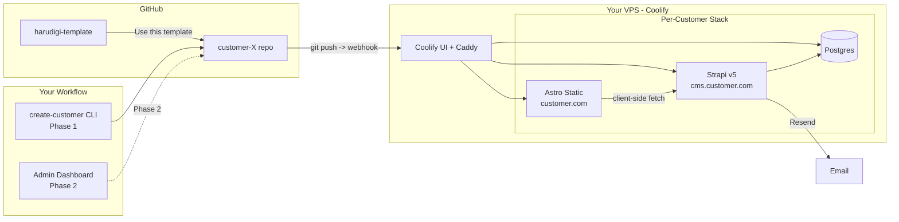

# Astro + Strapi Modular Customer Template

## 1. Architecture overview



Key choices locked in:
- **Astro static-only** — all dynamic features (booking, forms) are client-side JS calling the Strapi REST API. No SSR runtime to manage. Cloudflare Pages-portable later.
- **Per-customer Strapi v5 + Postgres** in Phase 1. Hybrid shared-tier is Phase 3.
- **All Strapi schemas always present**, disabled modules hidden via Strapi role permissions.
- **`site.config.ts`** is the single source of truth for module toggles, theme, locales, branding fallbacks.
- **Coolify on VPS** for GitHub-driven deploys, auto-SSL via its bundled reverse proxy.
- **Email**: Resend. **Spam**: Cloudflare Turnstile (optional). **Media**: local Docker volume. **Backups**: deferred to post-v1.
- **npm workspaces** monorepo, TypeScript for Astro, default JS for Strapi.

## 2. Repository layout

```
harudigi-template/
├── apps/
│   ├── web/                       # Astro static site (customer-facing)
│   │   ├── astro.config.mjs       # Reads site.config.ts, wires integrations
│   │   ├── site.config.ts         # PER-CUSTOMER: modules + theme + locales
│   │   ├── src/
│   │   │   ├── pages/[...slug].astro     # Page builder catch-all
│   │   │   ├── lib/strapi.ts             # Typed API client
│   │   │   ├── lib/modules.ts            # Conditional module loader
│   │   │   └── styles/tokens.css         # CSS variables, theme tokens
│   │   └── public/
│   ├── cms/                       # Strapi v5 + Postgres
│   │   ├── src/api/               # All collection types (always present)
│   │   │   ├── site/              # SINGLETON: branding, enabled modules, settings
│   │   │   ├── page/              # Page builder
│   │   │   ├── blog-post/, category/, tag/, author/
│   │   │   ├── service/, staff/, booking/, time-slot/
│   │   │   ├── portfolio-project/, team-member/, testimonial/
│   │   │   └── form-submission/
│   │   ├── src/components/        # Strapi components for page-builder blocks
│   │   ├── config/database.ts     # Postgres
│   │   └── Dockerfile
│   └── dashboard/                 # Phase 2 only
├── packages/
│   ├── ui/                        # Shared Astro components + Tailwind preset
│   │   ├── tailwind.preset.cjs
│   │   ├── tokens/                # Default + per-theme CSS variable sets
│   │   └── src/components/        # Button, Card, Section, Container, etc.
│   ├── modules/                   # ONE FOLDER PER FEATURE MODULE
│   │   ├── page-builder/          # Block components (Hero, Features, CTA, FAQ, ...)
│   │   ├── blog/                  # List, post, RSS, category pages
│   │   ├── forms/                 # Contact form + Resend + Turnstile
│   │   ├── booking/               # Service/staff/slot picker, booking form, email confirm
│   │   ├── seo/                   # Meta tags, sitemap, JSON-LD, robots, OG image
│   │   ├── i18n/                  # JP/EN/DE routing + Strapi i18n integration
│   │   ├── analytics/             # Plausible / Umami / GA4 switchable
│   │   ├── team-testimonials/
│   │   ├── portfolio/
│   │   └── cookie-consent/
│   └── themes/                    # 3 starter themes (clone & customize per customer)
│       ├── service-pro/           # For booking customers (photographers, salons, ...)
│       ├── editorial/             # For blog/portfolio-heavy
│       └── smb-clean/             # For SMB landing pages, restaurants, events
├── scripts/
│   └── create-customer.mjs        # Phase 1 CLI: prompts -> creates GitHub repo from template -> commits site.config.ts
├── docker/
│   ├── docker-compose.customer.yml   # Per-customer template Coolify uses
│   └── coolify-app-templates/        # Coolify "service templates" for one-click deploy
├── docs/
│   ├── architecture.md
│   ├── new-customer.md
│   ├── theme-customization.md
│   └── module-development.md
├── package.json                   # npm workspaces
└── README.md
```

## 3. The module system (the heart of "modular per customer")

`apps/web/site.config.ts` is the only file a customer fork meaningfully changes:

```ts
import type { SiteConfig } from "@harudigi/types";

const config: SiteConfig = {
  customer: { name: "Studio Mueller", domain: "studio-mueller.de" },
  theme: "service-pro",                        // service-pro | editorial | smb-clean | custom
  locales: { available: ["de", "en"], default: "de" },
  modules: {
    pageBuilder: true,
    blog: false,
    forms: true,
    booking: true,
    seo: true,
    i18n: true,
    analytics: { provider: "plausible" },
    teamTestimonials: true,
    portfolio: true,
    cookieConsent: true,
  },
  strapi: { url: "https://cms.studio-mueller.de", publicToken: "..." },
  email: { provider: "resend", from: "noreply@studio-mueller.de" },
  spam: { turnstile: { siteKey: "..." } },
};

export default config;
```

How it actually wires up:
- `astro.config.mjs` imports `site.config.ts` and conditionally registers Astro integrations exported from each enabled module package.
- Each module package exports an `astroIntegration()` that injects routes (e.g. `/blog/*`, `/booking`), middleware, and components only when enabled.
- Build excludes disabled modules from the bundle (no dead code shipped).
- On the Strapi side: schemas are always present, but the `Site` singleton stores `enabledModules` and the public API token's role only grants `find/findOne` on collections matching enabled modules. Disabled collections are also hidden in the admin via a custom plugin/policy that reads the singleton.

## 4. Theme system

Per your "fully custom" preference, themes are starting points, not constraints:
- `packages/ui/tailwind.preset.cjs` defines the default scale/utilities, all colors as `var(--color-*)`.
- Each theme in `packages/themes/*` provides:
  - `tokens.css` — CSS variables (colors, fonts, radii, spacing rhythm on the 8px grid)
  - `components/` — opinionated overrides of `Hero`, `Header`, `Footer`, `Card`, etc.
  - `tailwind.theme.cjs` — extends the preset
- Customer flow for bespoke design: pick the closest starter, copy it into `apps/web/src/theme/`, modify freely. The base `packages/ui` components stay generic so updates pull cleanly.
- All animations gated behind `@media (prefers-reduced-motion: no-preference)` per your accessibility rule.
- Semantic HTML5 (`<header>`, `<nav>`, `<main>`, `<article>`, `<section>`, `<footer>`) enforced in shared components.

## 5. Strapi schema strategy

A `Site` singleton ([apps/cms/src/api/site/](apps/cms/src/api/site/)) holds:
- Brand: name, logo, favicon, primary/secondary colors (override theme tokens at runtime via inline CSS variables in the layout)
- Contact: email, phone, address, social links
- `enabledModules`: JSON mirroring `site.config.ts` (built into Astro fetch helpers)
- SEO defaults: title template, default OG image, robots, JSON-LD org info
- Cookie consent text, analytics IDs, Turnstile keys

Per-module collections (only loaded by the Astro UI when enabled):
- **Page builder**: `Page` collection with a `blocks` dynamic-zone of components (`Hero`, `Features`, `CTA`, `FAQ`, `Testimonials`, `Stats`, `Logos`, `Gallery`, `RichText`, `Embed`).
- **Blog**: `BlogPost`, `Category`, `Tag`, `Author` (Strapi i18n on `BlogPost`).
- **Booking**: `Service` (name, duration, price, staff[]), `Staff` (name, photo, working hours JSON, services[]), `Booking` (service, staff, customer fields, status, datetime), `TimeSlot` derived dynamically from staff working hours minus existing bookings.
- **Portfolio**: `Project` (title, summary, hero image, gallery, tags, client, year, slug).
- **Team & Testimonials**: `TeamMember`, `Testimonial`.
- **Forms**: `FormSubmission` (form key, payload JSON, source page, IP, timestamp).

i18n: enable Strapi's i18n plugin with locales `de`, `en`, `ja`. All public-facing collections are localized.

## 6. Booking module (custom-simple)

Public flow (client-side only, talks to Strapi REST):
1. `/booking` — pick service. Astro fetches `Service`s at build, hydrates an island.
2. Pick staff (filtered by service).
3. Pick date — calendar component calls `GET /api/availability?staffId=&serviceId=&date=` (custom Strapi controller computes free slots from working hours minus existing `Booking`s).
4. Customer fills name/email/phone/notes + Turnstile.
5. `POST /api/bookings` (public role, rate-limited).
6. Strapi lifecycle hook sends Resend confirmation to customer + notification to staff/owner.

No payment in v1. Reschedule/cancel link via signed token in confirmation email is a Phase 2 candidate.

## 7. Customer onboarding (Phase 1: CLI)

`scripts/create-customer.mjs` does:
1. Prompts: customer name, domain, modules to enable, theme, locales, Resend API key, Turnstile keys.
2. Calls GitHub API to create a new repo from the template.
3. Clones it locally, writes `apps/web/site.config.ts`, copies the chosen theme into `apps/web/src/theme/`, sets `apps/cms/.env`.
4. Pushes initial commit.
5. Prints exact Coolify steps to register the two services (web + cms+pg) and connect the GitHub repo.

DNS: customer either points an A-record to the VPS (typical), or you manage Cloudflare for them — either way, Coolify provisions Let's Encrypt certs once the domain resolves.

## 8. Phase 2: Admin Dashboard

Separate app at `apps/dashboard/` (Astro + a small SQLite registry). Features:
- Customer list (status, modules, last deploy, build state polled from Coolify)
- "New customer" wizard wrapping the CLI logic + GitHub + Coolify APIs
- Toggle modules per customer (commits to that customer's `site.config.ts` and triggers redeploy)
- Logs viewer (Coolify API)
- Auth: just for you (single-user, GitHub OAuth)

## 9. Phase 3: Optional shared Strapi tier

For landing-only customers where running a dedicated Strapi feels wasteful:
- Add a `Site` relation to all collection types and a custom global policy that filters `find`/`findOne`/`create`/`update`/`delete` by the authenticated user's `siteId`.
- Each customer gets a Strapi user/role scoped to one `Site`.
- Astro fetches still work because the public token is also scoped per site.
- This requires schema migration of existing per-customer instances if you ever want to consolidate — design the schemas now to include nullable `site` from day one to keep the door open.

## 10. Hosting on the VPS (Coolify)

- Install Coolify on the VPS (one Docker command).
- Each customer = a Coolify "Project" containing 3 services: Astro static site (built from `apps/web`), Strapi (built from `apps/cms`), Postgres.
- Coolify reverse proxy (Caddy/Traefik bundled) handles auto-SSL for `customer.com` + `cms.customer.com`.
- Resource budget per customer: ~512MB RAM Strapi + ~256MB Postgres + static Astro served from disk = ~1GB. A 4GB VPS comfortably runs ~3 customers, an 8GB VPS ~6-7 customers.

## 11. Open risks / things to revisit

- **No backups in v1** is fine for proof-of-concept but should be your very first Phase 1.5 task; recommend Coolify's S3 backup integration with a free Backblaze B2 bucket.
- **Schema migrations across customer forks**: when you change a Strapi schema in the template, propagating to existing customer repos is manual (per your choice). Document the merge process clearly in `docs/upgrades.md`.
- **i18n + Strapi**: the `ja` locale needs to be added to Strapi's allowed locales config. Translations of UI strings ship in each module's `locales/{de,en,ja}.json`.
- **Booking edge cases** (timezones, DST, overlapping staff schedules) — keep scope tight in v1; document known limits.
- **Coolify multi-customer scaling**: at 10+ customers consider moving Postgres to a single managed instance with one DB per customer to reduce overhead.